# IBM CLoud Functions and Cloudant

##  подивитися потім

https://gist.github.com/ashvayka/4735c78541cebd26f3ed3d340743c697

## Зв'язування IBM Cloud Functions з хмарними сервісами  на прикладі  NoSqlDB IBM Cloudant

### Створення сервісу бази даних та Credential для інтеграції з іншими сервісами

- Створити сервіс можна, знайшовши в каталозі, або ж по прямому лінку:
[Cloudant create service](https://cloud.ibm.com/catalog/services/cloudant)

Екран показаний на pic-1
<kbd>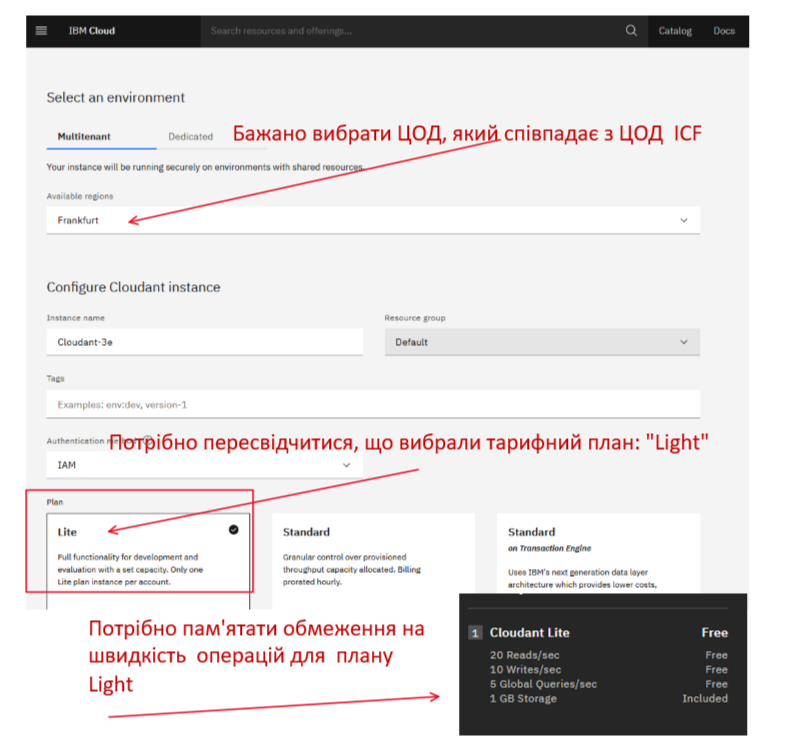</kbd>
<p style="text-align: center;">pic-1</p>

Зверніть увагу на обмеження.

- Переглянути credentials, і створити, якщо вони не створилися автоматично. Екран та  відповідне меню показано на [pic-2]

<kbd>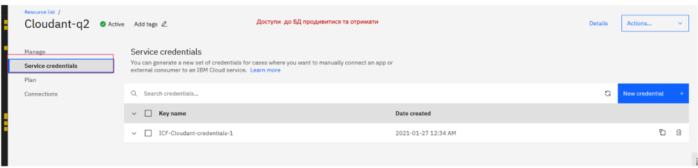</kbd>
<p style="text-align: center;">pic-2</p>


### Створення прикладного пакету ICF та його зв'язуваня з сервісом БД

  Після створення сервісу потрібно обов'язково вказати ресурсну групу сервісів, за замовчуванням "Default" в CLI. Пересвідчитися, що ви встановили  групу ресурсів можна командою:

  ```bash
    ibmcloud target -g Default
  ```  

Отримати опис credentials  для вибраного сервісу можна командою:

```bash

    ibmcloud resource service-keys --instance-name Cloudant-q2

```

- Розглянемо, що таке service bind  (зв'язування сервісів).

На pic-4  показана  діаграма, що можливо спросить розуміння цого процесу. 
<kbd>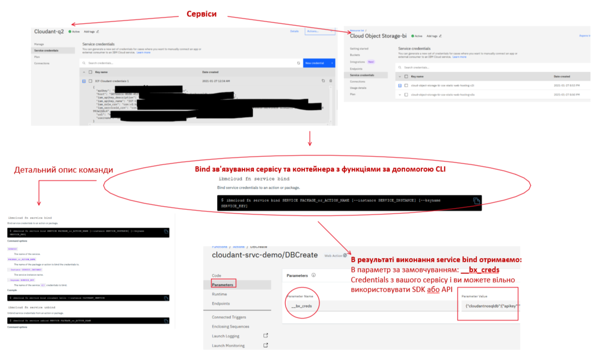</kbd>
<p style="text-align: center;">pic-4</p>


Тепер створимо пакет IVF та виконаємо звязування пакета  з сервісом БД Cloudant

[Швидкий доступ до переліку команд CLI](https://cloud.ibm.com/docs/openwhisk?topic=cloud-functions-cli-plugin-functions-cli#cli_pkg)

- Створимо пакет **cloudant-srvc-demo**
```bash
    ibmcloud fn package create cloudant-srvc-demo
```
Отримаємо результат:
```text
create cloudant-srvc-demo
ok: created package cloudant-srvc-demo
```

- Звяжемо пакет за БД Cloudant

```bash

ibmcloud fn service bind cloudantnosqldb  cloudant-srvc-demo --instance Cloudant-q2 --keyname ICF-Cloudant-credentials-1

```

результат:

```text
Credentials 'ICF-Cloudant-credentials-1' from 'cloudantnosqldb' service instance 'Cloudant-q2' bound to 'cloudant-srvc-demo'.

```
На pic-5  показано результат.
<kbd>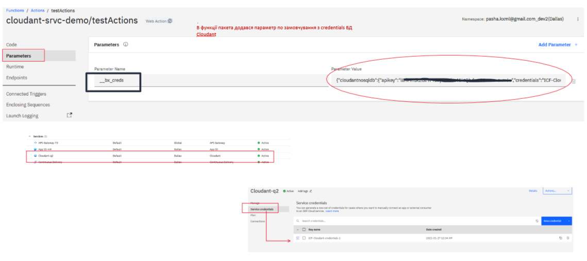</kbd>
<p style="text-align: center;">pic-5</p>

Виходячи з того, що є CLI через якй можна виконати практично всі команди по управлінню ICF,  можна побудувати процес колективної розробки з такими ключовими властивостями:
  
  * Розробка та відладка функцій ведеться локально;

  * Використання test driven developent  при розробці функцій

  * Програмний код зберігається в Source control;
  
  * Credentials  повинні  на локальній станції лежати окремо від прикладних параметрів і не попадати в source control;
  
  * Автоматичний deployment  по commit або по merge request;

  * Після deployment  провести невеликий тест функцій, щоб пересідчитися що вони працюють


### Модель колективної розробки

Призначення каталогів.

- deployment 
 Набір скриптів для deployemnt
 З приводу deployment цікаві такі лінки:
 [Deploying entities with a manifest file](https://cloud.ibm.com/docs/openwhisk?topic=openwhisk-deploy)

 [Cloud Functions CLI reference](https://cloud.ibm.com/docs/openwhisk?topic=cloud-functions-cli-plugin-functions-cli)

 - doc
 Документациія

 - params

 Json-файли з описом параметрів функцій для їх тестування. Використовується як локально, так і в хмарі при тестуванні функцій.

 приклад файлу з параметрами для функції DocCreate (./src/DocCreate.js)
   ./params/DocCreate.json

 ```json
      {

          "dbname": "db-demo-02",
          "doc": { "descr": "doc descr", "doctype": "DOC" }
          
      }
 ```

  - params.localdev

Json-файли з описом параметрів функцій, що включають credentials. В github  не передається, знаходиться в .gitignore

Приклад вайлу з описом реквізитів credentials  для підключення до  БД cloudant
./params.localdev/cloudant.json

``` json
{"cloudantnosqldb": {
                        "apikey": "",
                        "credentials": "",
                        "host": "",     
                        "iam_apikey_description": "",    
                        "iam_apikey_name": "",
                        "iam_role_crn": "",
                        "iam_serviceid_crn": "",
                        "instance": "",
                        "url": "",
                        "username": ""
                    }
}        
```


  - src 
  Програмний код функцій

  - test
  
  Програмний код тест-кейсів
  На прикладі показано як в тестовому кейсі  готуються параметри функції. 
  В файлі ./test-DocCreate.js  тесткейси для DocCreate (./src/DocCreate.js)

```js

  it('function DocCreate:' + ' Expect create document', function(done){

    var vfunc = require('../src/DocCreate');
    var vprm = require('../params/DocCreate.json');
    var vbx_creds = require('../params.localdev/cloudant.json');
    vprm.__bx_creds = vbx_creds;
  
    vfunc.main(  vprm  )
    .then (res => {
         res.should.have.property('ok');
         res.ok.should.equal(true);
         res.should.have.property('dbname');
         res.dbname.should.equal( vprm.dbname  );
         res.should.have.property('id');
         res.should.have.property('rev');


       if (test_env_lr) {
                console.log( JSON.stringify(  res  )  );
        }    
        done();

    })
    .catch ( err => {
            console.log(err.message);
            done(err);
  
    });
  });  //it


```

  В кореневому каталозі package.json з залежностями та manifest.yml з описом deployment пакету.

Таким чином, модель локальної розробки співпадає з моделлю deployment  по credential і взагалі вони (Credentials)  можуть бути не залежними.

  
### Викоритсання SDK та API  для сервісів


За ICF  можна безшовно поєднати [такі сервіси в хмарі IBM](https://cloud.ibm.com/docs/openwhisk?topic=openwhisk-services)


На pic-6  показано перелік.
<kbd>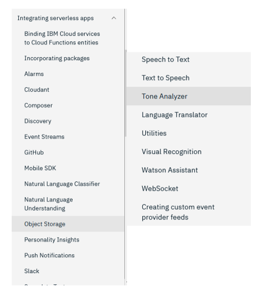</kbd>
<p style="text-align: center;">pic-6</p>

Більш детально, можете почитати за лінком [Binding IBM Cloud services to Cloud Functions entities](https://cloud.ibm.com/docs/openwhisk?topic=openwhisk-services)

Базшовна інтеграція - зачить в контейнері де запускається ваша функція уже встановлено відповідне SDK.
Перелік пакетів, які надаються за замовчуванням можна отримати за лінком:
[Node.js packages](https://cloud.ibm.com/docs/openwhisk?topic=openwhisk-runtimes#node-js-packages)

Про всі runtimes  можна почитати тут: [Runtimes](https://cloud.ibm.com/docs/openwhisk?topic=openwhisk-runtimes#runtimes_available)

Для роботи з NoSQL DB Cloudant (Couch DB) використовується  Node.js SDK, яке доступне за линком [](https://cloud.ibm.com/apidocs/cloudant)

Для Node.js ствроення документу в БД показано доить детально [pic-7]:


<kbd>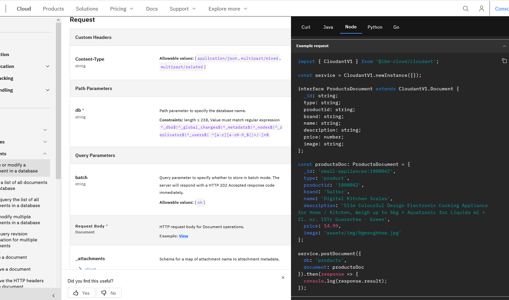</kbd>
<p style="text-align: center;">pic-7</p>

Відладку функції виконуємо через запуск тестових кейсів.

## Deploeyment з GitHub - подібного репозиторію

Для Deployemnt вкористовується класична toolchain . Її складові показані на [pic-8] 

<kbd>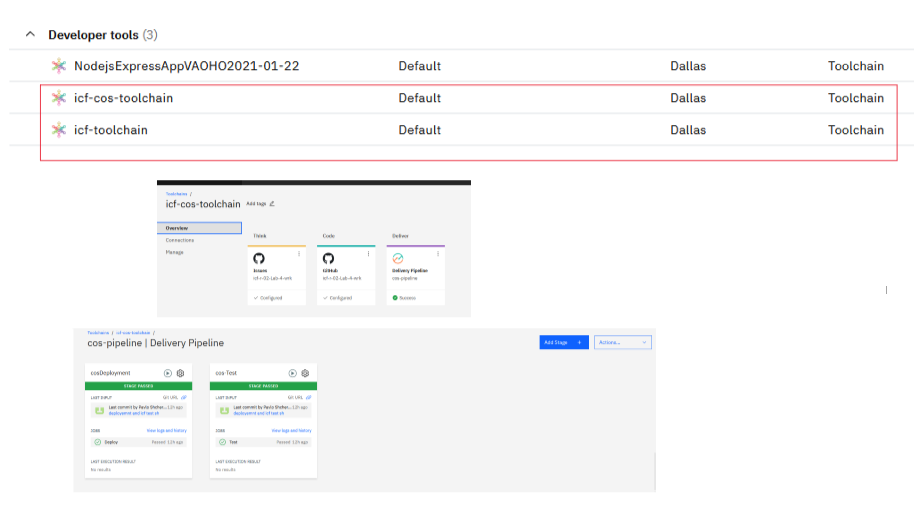</kbd>
<p style="text-align: center;">pic-8</p>

Процес deployemnt складається з двох кроків:

- deployemnt

- test


Для встановлення toolchain  потрібно виконати такі кроки

### Підключити сервіс [Continuous Delivery](https://cloud.ibm.com/catalog/services/continuous-delivery)

<kbd>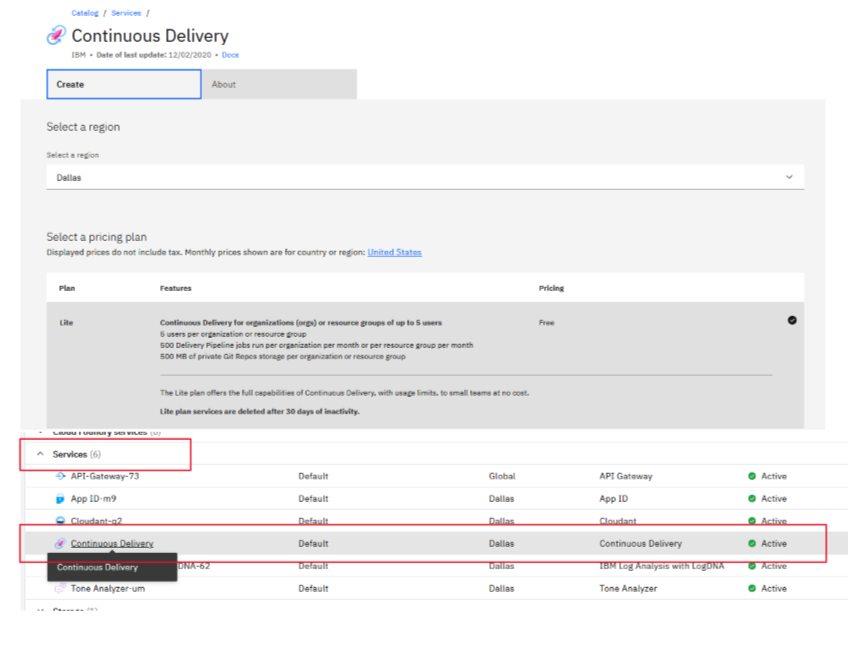</kbd>
<p style="text-align: center;">pic-9</p>


### Створити [Toolchain](https://cloud.ibm.com/devops/create)

З списку потрібно вибрати: [Build your own toolchain](https://cloud.ibm.com/devops/setup/deploy?repository=https%3A%2F%2Fgithub.com%2Fopen-toolchain%2Fempty-toolchain&env_id=ibm:yp:eu-de)

<kbd>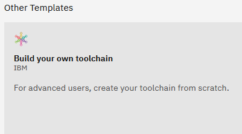</kbd>
<p style="text-align: center;">pic-10</p>


<kbd>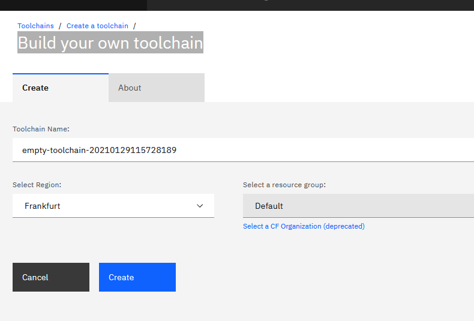</kbd>
<p style="text-align: center;">pic-11</p>

Потім по черзі додаємо Github Integration  та delivery pipeline [pic-12]

<kbd>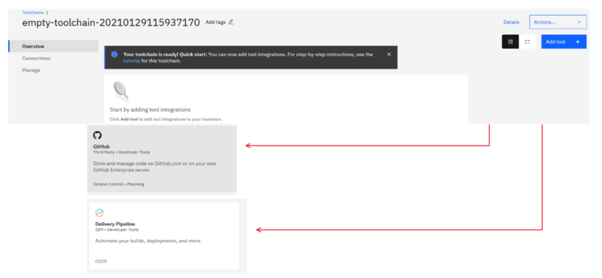</kbd>
<p style="text-align: center;">pic-12</p>

### Настройка інтеграціцї з github

На малюнку  [pic-13] показано як настроїти github. 


<kbd>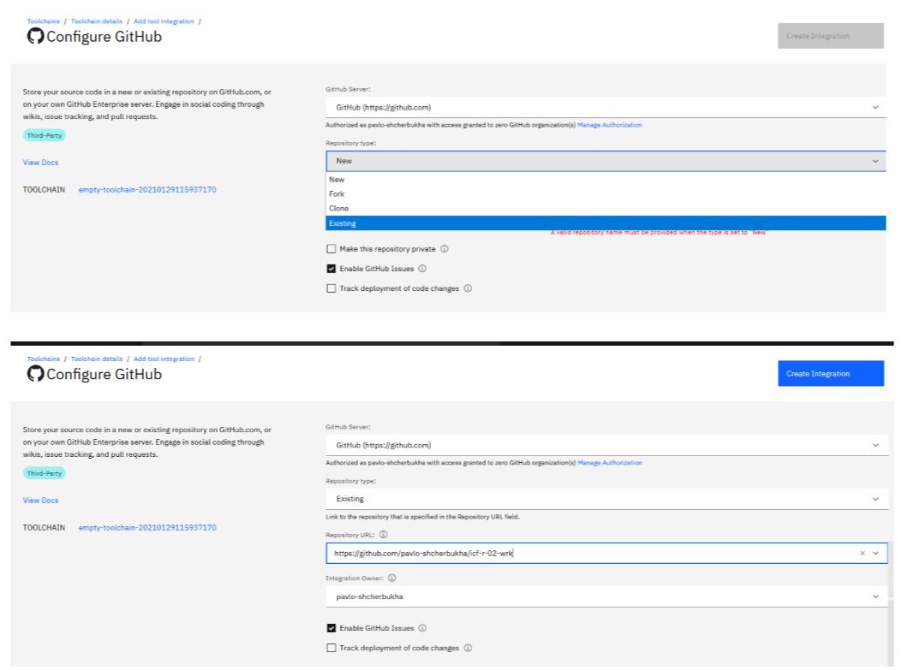</kbd>
<p style="text-align: center;">pic-13</p>

та що отримаємо в результаті
<kbd>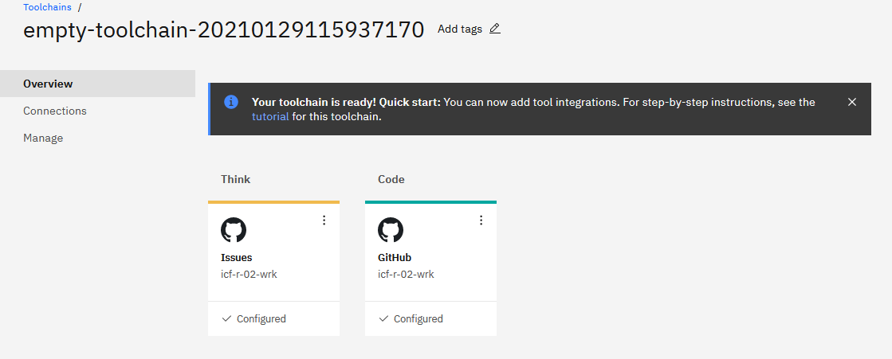</kbd>
<p style="text-align: center;">pic-14</p>

<kbd>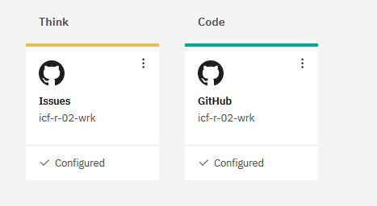</kbd>
<p style="text-align: center;">pic-15</p>

### Настройка Delivery Pipeline

Додати Delivery Pipeline та вказати найменування


Додати Delivery Pipeline та вказати найменування
<kbd>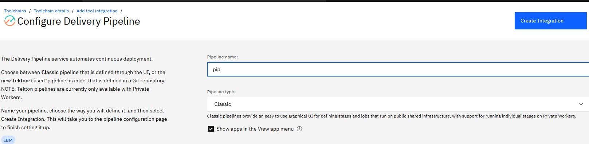</kbd>
<p style="text-align: center;">pic-16</p>

### Створити  стейджі Delivery Pipeline

Для цього додати стейджі через кнопку "Add Stage"
<kbd>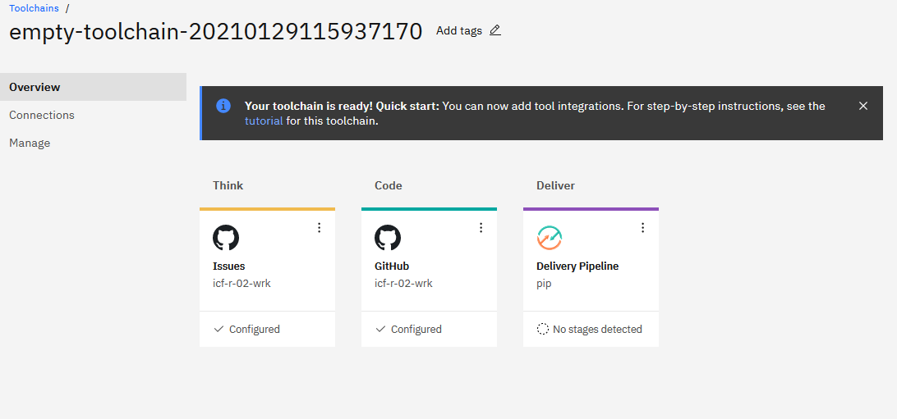</kbd>
<p style="text-align: center;">pic-17</p>

<kbd>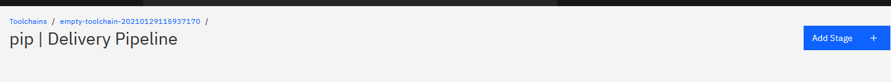</kbd>
<p style="text-align: center;">pic-17</p>

#### Створення Deployemnt Stage

- Спершу потрібно настроїти вкладку Input для  
Deployemnt Stage, що  забирає пограмний код з git

<kbd>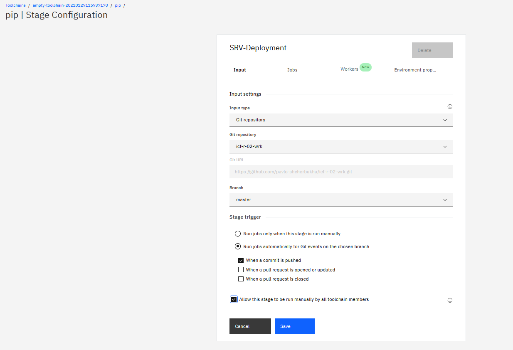</kbd>
<p style="text-align: center;">pic-19</p>

Та вибати опції, як показано.

- Перейти у вкладку ernvironment properties  та внести туди ваш API KEY  з яким система буде логінитися в IBM-Cloud

<kbd>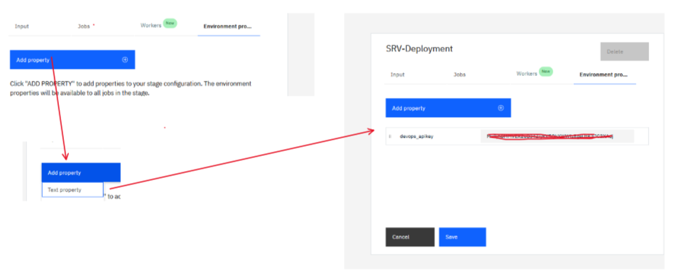</kbd>
<p style="text-align: center;">pic-20</p>


- Зайти у вкладку JOBS, створити deployment job та вставити в нього .sh  скрипт з  папки ./deployemnt/deploy-job.sh


<kbd>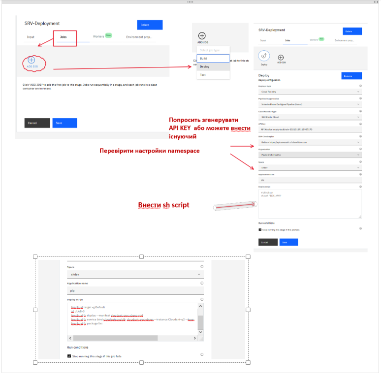</kbd>
<p style="text-align: center;">pic-21</p>


#### Створення Test Stage

- Додати ще stage  та назвати її Test

- У вкладці environemt внести api key
- У вклаlці  JOB  додати test job
- Вклеяти sh скрипт з файлу ./deployemnt/test-job.sh

<kbd>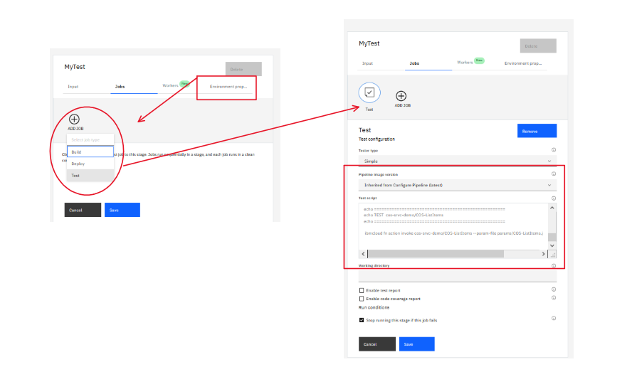</kbd>
<p style="text-align: center;">pic-22</p>

- настроїти вкладку Input
<kbd>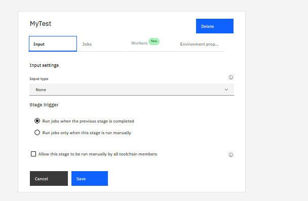</kbd>
<p style="text-align: center;">pic-23</p>


#### Запустити Stages вручну для перевірки
Результати показані на pic-24

<kbd>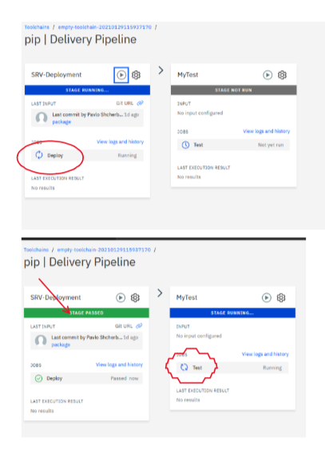</kbd>
<p style="text-align: center;">pic-24</p>