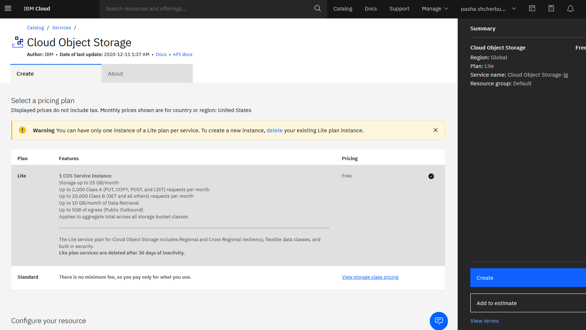
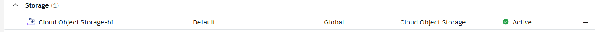
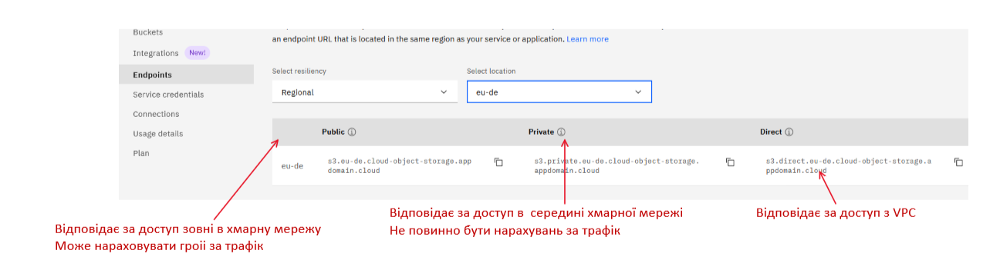
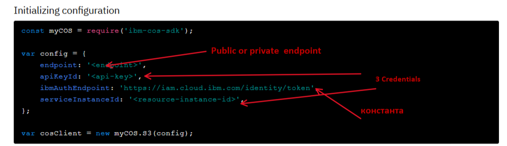

# IBM Cloud Functions and COS


## IBM Cloud Object Storage (COS)

IBM® Cloud Object Storage зберігає зашифровані та розподілені дані в різних географічних розташуваннях. 

Можна знайти в каталозі, а можна і по прямому лінку піти:
[Cloud Object Storage](https://cloud.ibm.com/objectstorage/create)

<kbd></kbd>
<p style="text-align: center;">pic-1</p>


Після успішного створення, його можна знайти в переліку ресурсів, у розділі: **Storage**

<kbd></kbd>
<p style="text-align: center;">pic-2</p>

Далі потрібно створити bucket. Бажано, в тому ЦОД, що і ICF.
Для спрощення, бажано створити тип Bucket **"Host a static website"**


У вкладці Credentials  потрібно перевірити їх присутність. Якщо немає - то створити.

Переглянути вкладку endpoint.призначення endpoints  розписано на pic 3

<kbd></kbd>
<p style="text-align: center;">pic-3</p>


## Зв'язування IBM Cloud Functions з хмарним сервісом  COS

Лінк на SOC SDK  для Node.js:
[COS SDK](https://cloud.ibm.com/docs/cloud-object-storage?topic=cloud-object-storage-node#node-examples-new-file)


Конфігурація доступа  настроюється так, як на малюнку pic-4

<kbd></kbd>
<p style="text-align: center;">pic-4</p>

Тому, в parma.localdev - лежать credentials, а  public URL  передається в параметрах (params).

Для прикладу розроблені функції 

- COS-BacketList.js отримати списко бакетів
- COS-GetObject.js  прочитати об'єкт (файл)
- COS-ListItems.js  отримати перелік файлів
- COS-PutObject.js  записати файл (текстовий)

В описі SDK  є приклад, як зробити multipart upload


## Bind

Виконується команда

```
    ibmcloud fn service bind cloud-object-storage cos-srvc-demo --keyname cloud-object-storage-bi-cos-static-web-hosting-c2i
```

