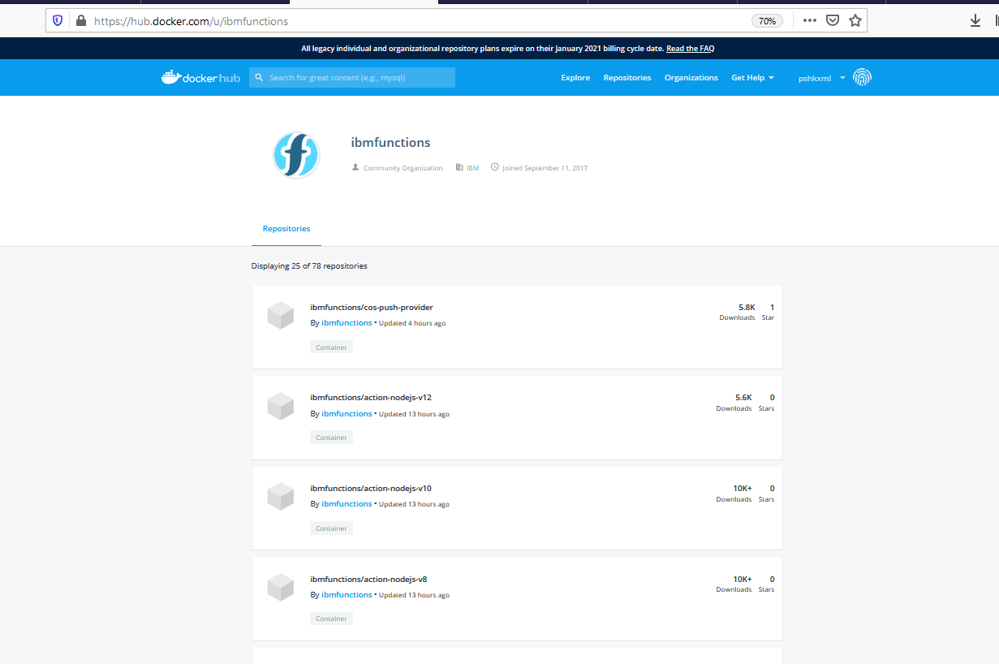
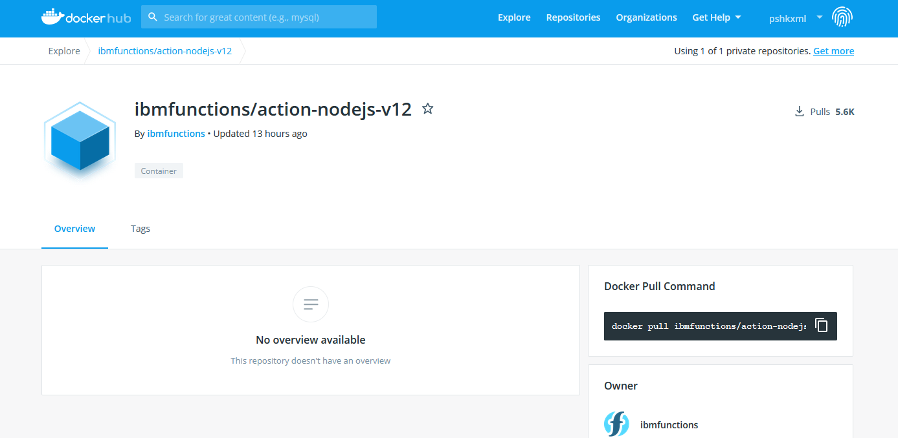
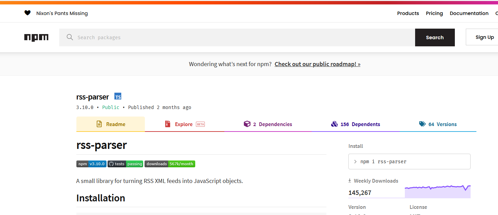
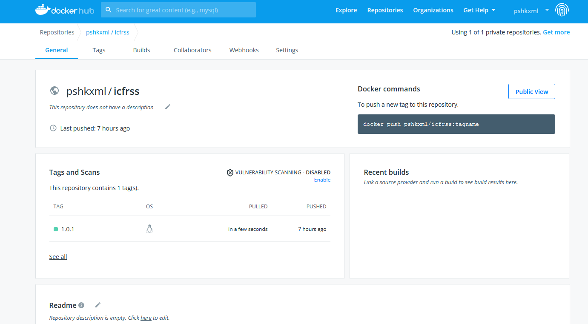
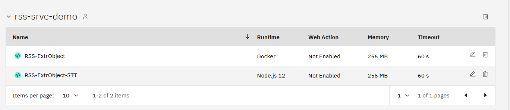
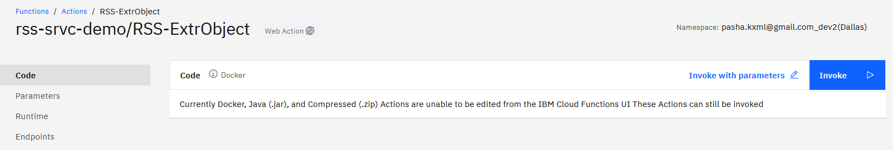

# IBM CLoud Functions  Розробка функцій зі сторонніми бібліотеками


Дуже часто потрібно додати свої npm - модулі для розробки функцій. Але їх немає в стандартній поставці. Що робити тоді. Є 2 варіанти:

- пакування zip-файлу і його загрузка;
- створення свого контейнеру і уже жеплоїти функцію у свй контейнер.

В цьому випадку є одне обмеження - контейнер повинен лежатив публічному docker  репозиторії. Використання zip файлу не так очевидно, тому що існують обмеження на його розмір.


## Лінки на документацію:

[Перелік стандартних пакетів Node.js](https://cloud.ibm.com/docs/openwhisk?topic=openwhisk-runtimes#node-js-packages)

[Підготовка вашого app в Docker image](https://cloud.ibm.com/docs/openwhisk?topic=openwhisk-prep#prep_docker)

[DockerHub образи для різних runtimes-мов програмування ](https://hub.docker.com/u/ibmfunctions)

<kbd></kbd>
<p style="text-align: center;">pic-1</p>


## Методика розробки.

Розгортаєму такуж саму стандартну структуру каталогів, що і для Lab-3, Lab-4.
Додається каталога ./Build
в якому занходиться dockerfile та cmd файл для побудови свого образу та розміщення його в свій публічний docker репозиторій

<kbd></kbd>
<p style="text-align: center;">pic-2</p>


## Постанока задачі

Потрібно розробити функцію, що по  буде скачувати  RSS - потік новин, тарнсформуати її з XML в JSON. Та, записати отримани JSON на Cloud Object Storage.

Для трансформації XML RSS в JSON  використаємо npm пакет
[rss-parser](https://www.npmjs.com/package/rss-parser)


```
    npm i rss-parser
```

<kbd></kbd>
<p style="text-align: center;">pic-3</p>


### Розробка та тестування функціх локально

Для цього виконуємо традийійний

```
    npm i rss-parser
```

та пишемо функцію і тестові кейси

- RSS-ExtrObject.js  функція
- test-RSS-ExtrObject.js  тестовий кейс
- Параметри функції 
        - RSS-ExtrObject.json 
        - RSS-ExtrObject_1.json
        - RSS-ExtrObject_2.json  

```text

{  
   "pub_endpoint": "s3.eu-de.cloud-object-storage.appdomain.cloud",
   "bucket": "cloud-object-storage-bi-cos-static-web-hosting-c2i",
   "rss_url": "https://censor.net.ua/includes/resonance_en.xml",
   "rss_name": "censor_net.json"
}


{  
   "pub_endpoint": "s3.eu-de.cloud-object-storage.appdomain.cloud",
   "bucket": "cloud-object-storage-bi-cos-static-web-hosting-c2i",
   "rss_url": "http://feeds.bbci.co.uk/news/education/rss.xml",
   "rss_name": "bbc_education.json"
}

{  
   "pub_endpoint": "s3.eu-de.cloud-object-storage.appdomain.cloud",
   "bucket": "cloud-object-storage-bi-cos-static-web-hosting-c2i",
   "rss_url": "http://feeds.bbci.co.uk/news/rss.xml",
   "rss_name": "bbc_news.json"
}

{  
   "pub_endpoint": "s3.eu-de.cloud-object-storage.appdomain.cloud",
   "bucket": "cloud-object-storage-bi-cos-static-web-hosting-c2i",
   "rss_url": "http://feeds.bbci.co.uk/news/rss.xml",
   "rss_name": "bbc_news.json"
}

```

Коли функція  розроблена та протестована настав час збирання образу

### Створення образу Docker

  -  Написати простий Docker файл
     При побудові образу ми додаємо потрібний пакет

  **./build/Docker**
  
  ```
      FROM ibmfunctions/action-nodejs-v12
      RUN npm install rss-parser 

  ```

  - Побудувати образ, помітитийого tag  та помістити в публічний Docker -  репозиторій

  **./build/build.cmd** 
  
  ```text

####### Побудувати отбраз локально
docker build -t pshkxml/icfrss .

###### Поставити tag для розміщення в публічному репозиторії
docker tag pshkxml/icfrss:latest pshkxml/icfrss:1.0.1

###### push to docker Відправити в публічний репозиторій
docker push pshkxml/icfrss:1.0.1
```


<kbd></kbd>
<p style="text-align: center;">pic-4</p>


### Deployemnt функції

В йьому випадку через yaml файл деплоймент на проходить
Потрібно  кожну функцію деплоїти окремо. При йьому в команді
action create або action update  вказуемо посилання на репозиторій

** --docker pshkxml/icfrss:1.0.1 **

```
    ibmcloud fn package create rss-srvc-demo
    ibmcloud fn action update rss-srvc-demo/RSS-ExtrObject --docker pshkxml/icfrss:1.0.1 src/RSS-ExtrObject.js
```

<kbd></kbd>
<p style="text-align: center;">pic-5</p>


<kbd></kbd>
<p style="text-align: center;">pic-6</p>
